# docSeek: Local-First Agentic RAG

A privacy-first, fully local **agentic Retrieval-Augmented Generation (RAG)** system built with **FastAPI**, **FAISS**, **Sentence Transformers**, and **SQLite**. 

All document processing, embedding generation, vector search, reranking, speech-to-text, text-to-speech, and LLM reasoning run entirely on your device. **Nothing leaves your machine.**

---

## 📖 Table of Contents
1. [Key Features](#-key-features)
2. [System Architecture](#%EF%B8%8F-system-architecture)
3. [Project Structure](#-project-structure)
4. [Hardware & OS Requirements](#-hardware--os-requirements)
5. [Step-by-Step Installation](#-step-by-step-installation)
6. [Quickstart & Usage Guide](#-quickstart--usage-guide)
7. [Agentic RAG & Features Overview](#-agentic-rag--features-overview)
8. [Configuration Environment Reference](#-configuration-environment-reference)
9. [Troubleshooting & Maintenance](#-troubleshooting--maintenance)

---

## 🚀 Key Features

*   **Agentic Retrieval Loop (LangGraph):** A local LLM agent orchestrated as a LangGraph `StateGraph` dynamically plans each query (rewriting, decomposition), decides whether to rerank, grades retrieved evidence, and re-loops with reformulated queries when evidence is weak (Corrective RAG).
*   **Multi-Notebook isolation:** Organize your document database into isolated "notebooks." Each notebook retains its own sqlite database, FAISS index, and upload directory.
*   **Hybrid Search with RRF:** Combines dense vectors (FAISS, `all-mpnet-base-v2`) with keyword search (SQLite FTS5) using Reciprocal Rank Fusion (RRF) for robust search matches.
*   **Local Cross-Encoder Reranking:** Re-scores candidates using `ms-marco-MiniLM-L-6-v2` on-device when precision is critical.
*   **OCR PDF Fallback:** Ingests scan-only or image-based PDFs using an on-device Tesseract OCR engine fallback.
*   **Smart Ingestion Chunking:** Choose between `recursive` character boundaries, `semantic` topic-shift embeddings, or `auto` profiling (which chooses strategies per document based on file contents).
*   **Local Dictation:** In-browser microphone support records audio and transcribes it on-device using `faster-whisper` (`POST /transcribe`).
*   **Audio Podcasts & TTS:** Generates two-host discussions or read-aloud versions of sources and answers using Kokoro TTS (`POST /podcast`).
*   **Deep Research Reports:** Writes detailed, cited reports using multi-section planning and streaming generation (`POST /research`).

---

## 📸 Screenshots

### Notebooks Selection Dashboard
Displays all your local, isolated document databases with metadata.


### Three-Panel Workspace View
A side-by-side interface for checking sources, discussing with the AI assistant featuring inline citations, and keeping notes.


---

## ⚙️ System Architecture

```mermaid
graph TD
    %% Ingestion Flow
    subgraph Ingestion Pipeline
        Doc[Upload Documents] --> Detect{File Type}
        Detect -->|PDF/Image| OCR{Scan Only?}
        OCR -->|Yes| Tesseract[Tesseract OCR Fallback]
        OCR -->|No| PyPDF[PDF Text Extraction]
        Detect -->|Markdown/HTML/Office| Parse[Text Extractors]
        Tesseract & PyPDF & Parse --> Chunk{Chunking Strategy}
        Chunk -->|Recursive| Rec[Recursive Splitting]
        Chunk -->|Semantic| Sem[Semantic Topic-Shift Embedding]
        Chunk -->|Auto| Aut[Auto-Profile Selection]
        Rec & Sem & Aut --> Ingest[Save Ingestion]
        Ingest --> SQLite[(SQLite FTS5 Text DB)]
        Ingest --> FAISS[(FAISS Vector Index)]
    end

    %% Query Flow
    subgraph Query Execution Pipeline
        QueryInput[User Query] --> AskMode{Query Type}
        AskMode -->|Plain Search| Search[Hybrid Search: FTS5 + FAISS]
        AskMode -->|Agentic Ask| LangGraph[LangGraph Agent Loop]
        
        LangGraph --> Plan[Plan Query & Dynamic K]
        Plan --> Search
        Search --> RRF[Reciprocal Rank Fusion]
        RRF --> RerankCheck{Agent Needs Rerank?}
        RerankCheck -->|Yes| CrossEncoder[Local Cross-Encoder Reranker]
        RerankCheck -->|No| Grade[Grade Evidence Quality]
        CrossEncoder --> Grade
        
        Grade --> Confidence{Good Quality?}
        Confidence -->|No & Retries Left| Rewrite[Query Rewriter]
        Rewrite --> Search
        Confidence -->|Yes / Max Loops| Generate[Synthesize Answer]
        Generate --> LLM[Local LLM via Ollama]
        LLM --> Stream[Stream SSE Response]
    end
    
    style Ingestion Pipeline fill:#1a1b26,stroke:#7aa2f7,stroke-width:2px;
    style Query Execution Pipeline fill:#1a1b26,stroke:#bb9af7,stroke-width:2px;
    style SQLite fill:#2ac3de,stroke:#3d59a1
    style FAISS fill:#2ac3de,stroke:#3d59a1
    style LLM fill:#e0af68,stroke:#ff9e64
```



---

## 📂 Project Structure

```text
.
├── app/
│   ├── core/           # Core Engines & Helpers
│   │   ├── config.py   # System settings, models, paths
│   │   ├── database.py # SQLite schema, connections, and CRUD
│   │   └── engine.py   # Embedding generation & FAISS logic
│   ├── server.py       # FastAPI application endpoints & SSE
│   └── ingest.py       # CLI command tool for ingestion
├── data/               # Persistent data folder (ignored by Git)
│   └── notebooks/      # Isolated multi-notebook databases
│       └── <notebook_id>/
│           ├── docs.db        # Metadata & full text database
│           ├── my_index.faiss # FAISS vector index
│           └── uploads/       # Copy of uploaded raw documents
├── frontend/           # Vite + React User Interface
├── scripts/            # Shell scripts
│   └── install_audio.sh # Audio TTS stack bootstrap
├── run.sh              # Unified dev runner (Frontend + Backend)
├── run_server.sh       # Backend-only runner
└── requirements.txt    # Base Python dependencies
```

---

## 💻 Hardware & OS Requirements

- **OS:** macOS (Apple Silicon highly recommended), Linux (Ubuntu/Debian supported).
- **RAM:** Minimum 8GB (16GB+ recommended to run Embedding models + Cross-Encoder + Ollama concurrently).
- **Disk Space:** ~5GB for local model checkpoints (HuggingFace cache + Ollama models).

---

## 🛠️ Step-by-Step Installation

### Step 1: Install System Dependencies
docSeek requires some external binaries for scanned PDF processing (OCR) and text-to-speech audio phonemization:

- **macOS (via Homebrew):**
  ```bash
  brew install tesseract espeak-ng ffmpeg
  ```
- **Linux (Debian/Ubuntu):**
  ```bash
  sudo apt-get update
  sudo apt-get install -y tesseract-ocr espeak-ng ffmpeg
  ```

### Step 2: Set up Virtual Environment
Navigate to the repository root directory and construct a Python 3.10+ virtual environment:
```bash
python3 -m venv .venv
source .venv/bin/activate
```

### Step 3: Install Core Python Packages
Upgrade pip and install the core backend package stack:
```bash
pip install --upgrade pip
pip install -r requirements.txt
```

### Step 4: Install the Audio & TTS Stack
Because the Kokoro TTS package requires strict dependency overrides to avoid conflict with the numpy 2.x system, you must run the standalone installer:
```bash
chmod +x scripts/install_audio.sh
./scripts/install_audio.sh
```

### Step 5: Install & Configure Ollama
Ollama orchestrates the local LLM agent.
1. Download Ollama from [ollama.com](https://ollama.com).
2. Start the Ollama application.
3. Download the default model (`phi3:mini`) and a stronger recommendation for Deep Research (`qwen2.5:7b` or `llama3.1`):
   ```bash
   ollama pull phi3:mini
   ollama pull qwen2.5:7b
   ```

---

## 🏁 Quickstart & Usage Guide

### 1. Launching docSeek
To boot both the FastAPI backend and the Vite frontend simultaneously:
```bash
./run.sh
```
*   **Web Frontend:** [http://localhost:5173](http://localhost:5173) or [http://localhost:3000](http://localhost:3000)
*   **FastAPI backend:** [http://localhost:8000](http://localhost:8000)
*   **Interactive Swagger API Docs:** [http://localhost:8000/docs](http://localhost:8000/docs)

To run the backend only:
```bash
./run_server.sh
```

### 2. Ingesting Files (CLI)
You can ingest folders of documents recursively. You must specify the **notebook ID** to keep your data isolated:

```bash
# Ingest markdown files into the 'my-first-workspace' notebook
python -m app.ingest --notebook my-first-workspace ./docs "**/*.md"
```

---

## 💡 Agentic RAG & Features Overview

### `/ask` vs `/search`
- **`/search` (Hybrid Retrieval):** Searches SQLite BM25 + FAISS Dense Vector indexes. Returns a fused RRF ranking with cross-encoder reranking.
- **`/ask` (Agentic RAG):** Starts a LangGraph loops system. The LLM acts as an agent to rewrite poorly formatted questions, fetches documents, grades retrieved chunks, and loops back to query different angles if confidence is low.

### Local Voice Dictation
Click the microphone icon in the UI. The application records audio locally and calls `POST /transcribe`. The server runs `faster-whisper` on-device to transcribe audio to text instantly, sending it to the chat input field.

### Audio Podcasts & TTS
In the Studio tab of the UI:
1. Select the ingested files you want.
2. Click **Generate Podcast**.
3. The server uses Ollama to draft a script, and Kokoro TTS reads it with two distinct local voices (`af_heart` and `am_michael`), outputting a fully local `.wav` audio.

---

## 🔧 Configuration Environment Reference

You can customize docSeek variables using environment variables or editing [config.py](file:///Users/dan/projects/standalone/docSeek---Modular-RAG-system-/app/core/config.py):

| Env Variable | Default | Purpose |
| :--- | :--- | :--- |
| `DOCSEEK_PORT` | `8000` | Bind port for FastAPI. |
| `DOCSEEK_LLM_MODEL` | `phi3:mini` | Ollama model name used for agent loops and text synthesis. |
| `DOCSEEK_LLM_BASE_URL` | `http://localhost:11434/v1` | URL for Ollama client. |
| `DOCSEEK_STT_MODEL` | `small` | faster-whisper size model (`tiny`, `base`, `small`, `medium`). |
| `DOCSEEK_TTS_VOICE_A` | `af_heart` | First host's voice for Kokoro TTS. |
| `DOCSEEK_TTS_VOICE_B` | `am_michael` | Second host's voice for Kokoro TTS. |
| `CORS_ORIGINS` | `http://localhost:5173,http://localhost:3000` | Allowed web origins. |
| `ADMIN_TOKEN` | `None` | Set to a token string to secure destructive endpoints (like `/reset`). |

---

## 🧹 Troubleshooting & Maintenance

### Graceful Degradation
If Ollama is not active or unreachable, docSeek will automatically degrade to heuristic parameters and fall back to classic hybrid retrieval without crashing, meaning search queries and index uploads will still function.

### Database Reset
To clear all databases and index binaries, call the reset endpoint:
```bash
curl -X DELETE "http://localhost:8000/reset"
```
*(Or delete the folder `data/` manually).*
