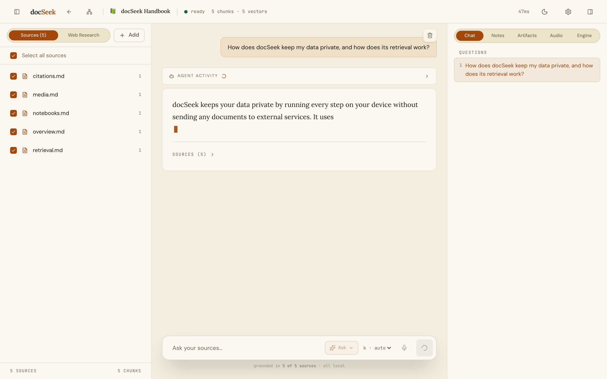
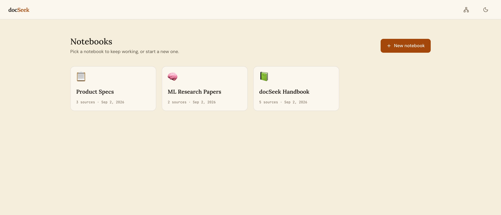
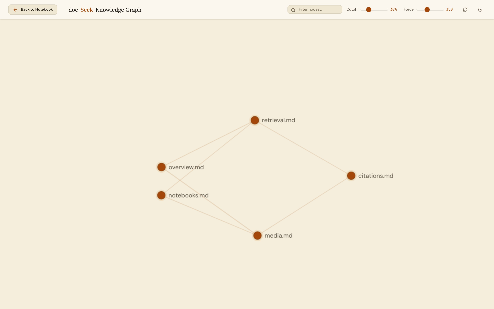

# docSeek — Local-First Agentic RAG

**Chat with your documents, 100% on your machine.** docSeek is a private, NotebookLM-style workspace where an on-device AI agent reads your files, answers questions with inline citations, and can even turn your sources into an audio overview — all without a single byte leaving your computer.

> Parsing, embeddings, vector search, reranking, speech-to-text, text-to-speech, and LLM reasoning run **entirely on your device**. Model weights download once from HuggingFace, then everything works fully offline.

Built with **FastAPI · FAISS · Sentence-Transformers · SQLite · Ollama · React (Vite)**.

---



<p align="center"><em>Ask a question and watch the local agent plan → retrieve → rerank → grade, then answer with clickable citations.</em></p>

---

## Table of Contents

- [What you can do](#what-you-can-do)
- [Quick Start (the easy way)](#quick-start-the-easy-way)
- [Manual Setup (step by step)](#manual-setup-step-by-step)
- [Using docSeek](#using-docseek)
- [Knowledge Graph](#interactive-knowledge-graph)
- [How it works](#how-it-works)
- [Configuration](#configuration)
- [Troubleshooting](#troubleshooting)
- [Project structure](#project-structure)

---

## What you can do

- 🔒 **Stay 100% local & private.** No cloud, no API keys, no telemetry. Your documents never leave the machine.
- 📚 **Organize work into notebooks.** Each notebook is a fully isolated corpus with its own database, vector index, and files — switch between projects without their contents ever mixing.
- 🧠 **Ask with an agent, not just search.** A local LLM plans each query, rewrites unclear questions, retrieves, reranks, grades the evidence, and re-tries when it's not good enough (Corrective RAG).
- 🕸️ **Explore connections via Knowledge Graph.** Visualize document relationships, cross-references, tags, and semantic cosine similarity clusters in an interactive 2D force-directed canvas.
- 🧩 **AST-Aware Code Ingestion.** Ingest whole repositories (Python, JavaScript, TypeScript, Markdown) with language-aware abstract syntax tree chunking that preserves function, class, and method boundaries.
- 🔎 **Hybrid retrieval.** Dense vectors (FAISS) fused with keyword search (SQLite FTS5) via Reciprocal Rank Fusion, with optional local cross-encoder reranking.
- 📄 **Ingest almost anything.** `.txt`, `.md`, `.html`, `.docx`, `.pdf` (with on-device OCR fallback for scanned PDFs), `.pptx`, pasted text, whole GitHub repos, or web pages.
- 🎙️ **Talk and listen.** Dictate questions with your mic (local Whisper), have answers read aloud, or generate a two-host **audio overview** of your sources (local Kokoro TTS).
- 🔍 **Research the web.** Search the internet from inside a notebook, preview results, and import what's useful — the content gets chunked, embedded, and becomes part of your local knowledge base. Deep research mode decomposes your question into sub-queries and generates a cited report.
- 📝 **Go deep.** Stream multi-section, cited **research reports** across your sources.



<p align="center"><em>Every project lives in its own isolated notebook.</em></p>

---

## Quick Start (the easy way)

**Prerequisites** (install these first):

| Need | Why | Install |
| :--- | :--- | :--- |
| **Python 3.10+** | Backend | [python.org](https://www.python.org/) |
| **Node.js 18+** | Frontend | [nodejs.org](https://nodejs.org/) |
| **Ollama** | Local LLM for agentic answers | [ollama.com](https://ollama.com) |
| **Docker** | Local web research (SearXNG, optional) | [docker.com](https://docker.com) |
| tesseract, espeak-ng, ffmpeg | OCR + audio (optional) | `brew install tesseract espeak-ng ffmpeg` |

**Then, from the project root:**

```bash
# 1. Install everything (Python + audio + frontend deps) in one command
./setup.sh

# 2. Pull the default local model
ollama pull qwen2.5:1.5b       # fast, reliable JSON agent (or phi3:mini)

# 3. (Optional) Start SearXNG for web research
docker compose up -d

# 4. Launch docSeek (backend + frontend together)
./run.sh
```

Open **[http://localhost:5173](http://localhost:5173)** and you're in. 🎉

> `setup.sh` is idempotent and only tells you what's missing — it won't overwrite anything or fail on optional pieces.

---

## Manual Setup (step by step)

Prefer to run each step yourself? Here's exactly what `setup.sh` does.

**1. System dependencies** (for scanned-PDF OCR and audio phonemization):

```bash
# macOS (Homebrew)
brew install tesseract espeak-ng ffmpeg

# Debian / Ubuntu
sudo apt-get update && sudo apt-get install -y tesseract-ocr espeak-ng ffmpeg
```

**2. Python environment:**

```bash
python3 -m venv .venv
source .venv/bin/activate
pip install --upgrade pip
pip install -r requirements.txt
```

**3. Local audio / TTS stack** (Kokoro needs special dependency handling — see the script's comments):

```bash
./scripts/install_audio.sh
```

**4. Frontend dependencies:**

```bash
cd frontend && npm install && cd ..
```

**5. Ollama** (the local LLM that powers the agent):

```bash
# Install Ollama from https://ollama.com and start it, then:
ollama pull qwen2.5:1.5b       # default, fast & reliable structured agent
ollama pull phi3:mini          # alternative lightweight 3.8B model
ollama pull qwen2.5:7b         # optional, stronger — better research reports & podcasts
```

**6. Web Research Engine (optional):**

```bash
docker compose up -d           # starts SearXNG on http://localhost:8080
```

**7. Run it:**

```bash
./run.sh            # backend + frontend
# or backend only:
./run_server.sh
```

| Service | URL |
| :--- | :--- |
| Web app | http://localhost:5173 |
| Backend API | http://localhost:8000 |
| Interactive API docs (Swagger) | http://localhost:8000/docs |

> **No Ollama?** docSeek still runs — it gracefully degrades to plain hybrid search and skips the agent's LLM steps. Podcasts and research reports need the LLM.

### Hardware notes

- **OS:** macOS (Apple Silicon recommended) or Linux (Ubuntu/Debian).
- **RAM:** 8 GB minimum, 16 GB+ recommended (embedder + cross-encoder + Ollama together).
- **Disk:** ~5 GB for cached model weights (HuggingFace + Ollama).

---

## Using docSeek

1. **Create a notebook** from the dashboard (`+ New notebook`) and open it.
2. **Add sources** with `+ Add` — drag in files, paste text, or ingest a GitHub repo. Uploads process in the background; you'll see them appear in the Sources panel.
3. **Ask.** Type in the bar at the bottom and pick a mode:
   - **Ask** — the full agentic loop with inline citations.
   - **Search** — raw hybrid retrieval, ranked results.
   - **Research** — a long, multi-section cited report.
4. **Scope retrieval** by checking/unchecking sources in the left panel.
5. **Do more in the Studio panel** (right): take notes, generate an audio overview, or inspect engine stats.
6. **Navigate the Knowledge Graph**: Click the network graph icon in the top header to reveal semantic connections, tags, and citation relationships across your corpus.

**Bulk ingest from the CLI** (each notebook is isolated, so pass its id):

```bash
python -m app.ingest --notebook <notebook-id> ./docs "**/*.md"
python -m app.ingest --notebook <notebook-id> --url https://example.com/page
```

---

## Interactive Knowledge Graph

Explore your document collection not just through linear search, but as an interconnected knowledge web.



<p align="center"><em>Visualize cross-document citations, semantic similarity clusters, and tag relationships in a responsive 2D canvas.</em></p>

- 🕸️ **Semantic Similarity Edges**: Nodes represent documents or individual chunks; edges map semantic cosine proximity above an adjustable threshold.
- 🎛️ **Real-Time Physics Tuning**: Adjust force-directed repulsion, minimum similarity thresholds, and cluster tension directly from the control drawer.
- 🔎 **Graph Filtering & Search**: Find specific nodes by keyword or tag to highlight isolated subgraphs.
- 📑 **Integrated Document Drawer**: Click any node to inspect chunk text, entity tags, references, and neighboring source passages.

---

## How it works

Each notebook is physically isolated on disk (`data/notebooks/<id>/` with its own SQLite DB, FAISS index, uploads, and audio). Every request is scoped to one notebook.


```mermaid
graph TD
    subgraph Ingestion Pipeline
        Doc[Upload / Paste / GitHub / Web] --> Detect{File Type}
        Detect -->|Code py/js/ts| AST[AST Syntax Chunking]
        Detect -->|PDF/Image| OCR{Scanned?}
        OCR -->|Yes| Tesseract[Tesseract OCR]
        OCR -->|No| PyPDF[PDF Text Extraction]
        Detect -->|MD/HTML/Office| Parse[Text Extractors]
        Tesseract & PyPDF & Parse & AST --> Chunk{Chunking Strategy}
        Chunk -->|recursive / semantic / AST / auto| Embed[Embed Chunks]
        Embed --> SQLite[(SQLite + FTS5)]
        Embed --> FAISS[(FAISS Index)]
        Embed --> GraphGen[Knowledge Graph Extractor]
        GraphGen --> GraphData[(Graph Nodes & Edges)]
    end

    subgraph Query Pipeline
        Q[User Query] --> CacheCheck{Semantic Cache?}
        CacheCheck -->|Hit| CachedAns[Return Cached Answer]
        CacheCheck -->|Miss| Mode{Mode}
        Mode -->|Search| Hybrid[Hybrid Search: FTS5 + FAISS]
        Mode -->|Ask| Agent[LangGraph Agent]
        Agent --> Plan[Plan query & dynamic k]
        Plan --> Hybrid
        Hybrid --> RRF[Reciprocal Rank Fusion]
        RRF --> Rerank{Rerank?}
        Rerank -->|Yes| Cross[Local Cross-Encoder]
        Rerank -->|No| Grade[Grade evidence]
        Cross --> Grade
        Grade -->|Weak & retries left| Rewrite[Rewrite query] --> Hybrid
        Grade -->|Good / max loops| Gen[Synthesize answer]
        Gen --> LLM[Local LLM via Ollama]
        LLM --> Stream[Stream SSE + citations]
    end

    style SQLite fill:#2ac3de,stroke:#3d59a1
    style FAISS fill:#2ac3de,stroke:#3d59a1
    style LLM fill:#e0af68,stroke:#ff9e64
```

**Models (all local):** embeddings `nomic-ai/nomic-embed-text-v1.5` (8192-token context, 768-dim) · reranking `ms-marco-MiniLM-L-6-v2` · dictation `faster-whisper` · TTS `Kokoro-82M` · reasoning via Ollama (`qwen2.5:1.5b` default or `phi3:mini`).

---

## Configuration

Set via environment variables (or edit `app/core/config.py`):

| Variable | Default | Purpose |
| :--- | :--- | :--- |
| `DOCSEEK_PORT` | `8000` | Backend port. |
| `DOCSEEK_LLM_MODEL` | `qwen2.5:1.5b` | Ollama model for the agent and generation. |
| `DOCSEEK_LLM_BASE_URL` | `http://localhost:11434/v1` | Ollama endpoint. |
| `DOCSEEK_EMBED_MODEL` | `nomic-ai/nomic-embed-text-v1.5` | Dense vector embedding model (8192 context). |
| `DOCSEEK_EMBED_DIM` | `768` | Embedding vector dimension. |
| `DOCSEEK_STT_MODEL` | `small` | faster-whisper size (`tiny`/`base`/`small`/`medium`). |
| `DOCSEEK_TTS_VOICE_A` / `_B` | `af_heart` / `am_michael` | The two podcast host voices. |
| `DOCSEEK_SEARXNG_URL` | `http://localhost:8080` | SearXNG endpoint for local web research. |
| `DOCSEEK_CRAWL4AI_ENABLED` | `false` | Enable Crawl4AI browser fallback for JS-heavy pages. |
| `DOCSEEK_RESEARCH_MAX_RESULTS` | `10` | Max results per web search query. |
| `CORS_ORIGINS` | `localhost:5173,localhost:3000` | Allowed web origins. |
| `ADMIN_TOKEN` | *(unset)* | Set a token to gate destructive endpoints (`/reset`, `/rebuild`, deletes). |

---

## Troubleshooting

- **Answers are generic / no citations.** Ollama isn't running or the model isn't pulled. Start Ollama and run `ollama pull qwen2.5:1.5b`. docSeek falls back to plain hybrid search when the LLM is unreachable.
- **First query is slow.** Models load lazily on first use (embedder, reranker, Whisper, Kokoro download once). Subsequent runs are fast.
- **Scanned PDF won't ingest.** Install `tesseract` (OCR). Without it, image-only PDFs are skipped cleanly rather than crashing.
- **Podcast/TTS fails.** Run `./scripts/install_audio.sh` and install `espeak-ng`.
- **Reset a notebook.** In Settings, or `curl -X DELETE "http://localhost:8000/reset?notebook_id=<id>"`. To wipe everything, delete the `data/` folder.
- **Regenerate the README screenshots** (needs Ollama running): `cd frontend && npm run screenshots` — it captures the real app into `docs/images/`.

---

## Project structure

```text
.
├── app/
│   ├── core/            # Engines & helpers
│   │   ├── config.py    # Settings, models, per-notebook path resolvers
│   │   ├── notebooks.py # Notebook registry (create/list/delete)
│   │   ├── database.py  # SQLite schema + queries (per notebook)
│   │   ├── engine.py    # Embeddings + FAISS index
│   │   ├── agent.py     # LangGraph agentic retrieval loop
│   │   ├── ast_chunking.py # AST parser for Python/JS/TS code
│   │   ├── graph.py     # Knowledge graph extraction & similarity edges
│   │   ├── cache.py     # Semantic response & retrieval cache
│   │   ├── web_research.py # SearXNG web decomposition & ingestion
│   │   ├── podcast.py   # Audio overview graph
│   │   └── research.py  # Deep-research graph
│   ├── server.py        # FastAPI endpoints + SSE
│   └── ingest.py        # CLI bulk ingestion
├── data/                # Persistent state (gitignored)
│   ├── notebooks.json   # Notebook registry
│   └── notebooks/<id>/  # Isolated per notebook:
│       ├── docs.db          #   SQLite + full text
│       ├── my_index.faiss   #   FAISS vectors
│       ├── uploads/         #   raw files
│       └── audio/           #   generated audio
├── frontend/            # React + Vite UI
│   ├── src/
│   │   ├── components/  # ChatPanel, GraphCanvas, SourcesPanel, StudioPanel...
│   │   ├── pages/       # Workspace, GraphPage, NotebooksPage, LandingPage
│   │   └── lib/         # API clients and SystemContext
│   └── scripts/         # Automated Playwright screenshot harness
├── scripts/             # install_audio.sh, debug tools
├── setup.sh             # One-command setup
├── run.sh               # Run backend + frontend
└── requirements.txt     # Backend dependencies
```

---

<p align="center"><sub>Everything local. Nothing leaves your machine.</sub></p>
