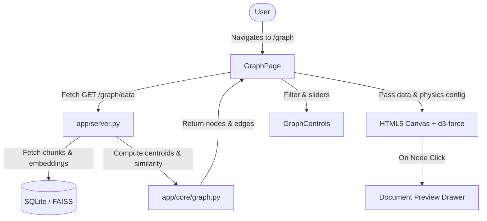

# Design Specification: Obsidian-style 2D Document Knowledge Graph & Embedding Map

**Date**: 2026-08-03  
**Status**: Approved  
**Target Feature**: Document Knowledge Graph / 2D Embedding Map  

---

## 1. Overview & Goal

The **Document Knowledge Graph** provides an interactive, 2D force-directed visual map of all ingested documents in docSeek. Built to mirror the visual aesthetics and physics of **Obsidian's Graph View**, it maps semantic relationships between documents based on vector embedding cosine similarity and metadata tags.

### Key Objectives
- **Obsidian Visual Design**: Dark cosmic theme (`#0b0f19` background), glowing canvas nodes, particle physics, subtle link highlights, smooth pan/zoom.
- **Interactive Control Panel**: Real-time slider for Cosine Similarity Threshold ($0.0 \dots 1.0$), Repulsion Force, Node Sizing, and Live Search/Filter.
- **Document Detail Drawer**: Click any node to slide open a preview panel displaying document metadata, chunk list, and nearest semantic neighbors.
- **Seamless Navigation**: Dedicated `/graph` page accessible from the main Sidebar.

---

## 2. Backend Architecture (`GET /graph/data`)

### Endpoint Details
- **Route**: `GET /graph/data?min_similarity=0.3`
- **Location**: `app/server.py` & `app/core/graph.py`

### Calculation Steps
1. **Document Embedding Centroids**:
   - For each unique `source_file` in the database, retrieve all associated chunk vectors.
   - Compute the document centroid vector $\mathbf{v}_{\text{doc}} = \frac{1}{N} \sum_{i=1}^N \mathbf{v}_{\text{chunk}_i}$.
2. **Cosine Similarity Matrix**:
   $$\text{sim}(D_i, D_j) = \frac{\mathbf{v}_i \cdot \mathbf{v}_j}{\|\mathbf{v}_i\| \|\mathbf{v}_j\|}$$
3. **Edge Filtering**:
   - **Similarity Edges**: Connect $D_i \leftrightarrow D_j$ if $\text{sim}(D_i, D_j) \ge \text{min\_similarity}$.
   - **Tag Edges**: Connect $D_i \leftrightarrow D_j$ if both documents share tags or directory paths (`weight = 1.0`, `type = "tag"`).

### Payload Schema
```json
{
  "nodes": [
    {
      "id": "source_file_path",
      "label": "document_name.pdf",
      "source_file": "docs/document_name.pdf",
      "chunk_count": 12,
      "tags": ["research", "ai"],
      "first_chunk_id": 105
    }
  ],
  "edges": [
    {
      "source": "source_file_path_1",
      "target": "source_file_path_2",
      "weight": 0.85,
      "type": "similarity"
    }
  ],
  "stats": {
    "total_documents": 18,
    "total_edges": 42
  }
}
```

---

## 3. Frontend Component Architecture

### Components
1. **`GraphPage.jsx` (`frontend/src/pages/GraphPage.jsx`)**:
   - Main container page under `/graph`.
   - Coordinates state between graph controls, canvas renderer, and document preview drawer.
2. **`GraphCanvas.jsx` (`frontend/src/components/GraphCanvas.jsx`)**:
   - High-performance HTML5 Canvas force-directed renderer (powered by `d3-force` / Canvas2D physics).
   - Render features:
     - Obsidian color palette: glowing cyan/emerald nodes (`#38bdf8`, `#34d399`), deep cosmic dark background (`#0b0e17`), glowing node hover rings.
     - Particle force layout with velocity dampening.
     - Pan & Zoom with smooth drag interactions.
3. **`GraphControls.jsx` (`frontend/src/components/GraphControls.jsx`)**:
   - Glassmorphism floating control card overlaid on the canvas.
   - Sliders: Cosine Similarity Threshold ($0.1 \dots 0.95$), Repulsion Force, Node Size.
   - Search input: Filter nodes live with instant visual highlighting.
4. **`DocumentDrawer.jsx` (`frontend/src/components/DocumentDrawer.jsx`)**:
   - Slide-over panel when a node is clicked.
   - Shows document title, file metadata, total chunks, preview text, and top connected neighbor files.

---

## 4. Architecture & Data Flow



---

## 5. Verification Plan

- **Backend Verification**: Test `GET /graph/data` endpoint with Python pytest to ensure correct JSON schema, similarity calculations, and edge filtering.
- **Frontend Verification**:
  - Run `npm run lint` and `npm run build` in `frontend/`.
  - Manual UI verification: Pan, zoom, node drag, slider adjustment, node selection, and drawer slide-out.
