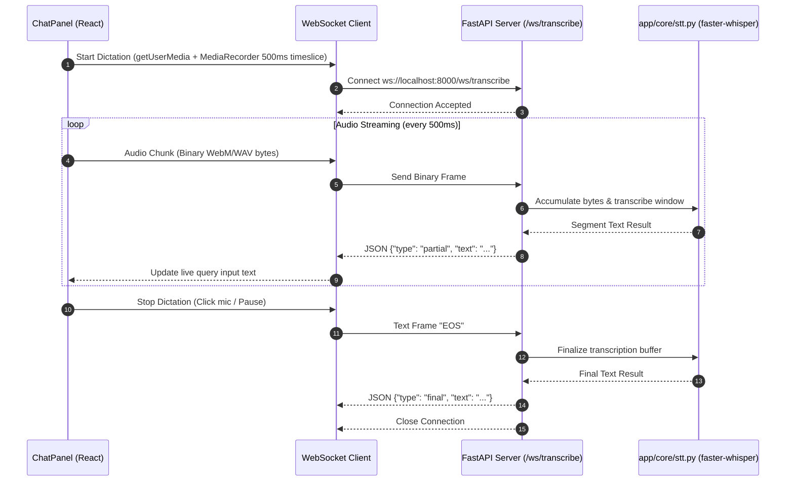

# Design Spec: Streaming WebSocket Dictation

## Goal
Upgrade docSeek's local speech-to-text dictation from a POST-only batch recording flow (`POST /transcribe`) to a real-time, zero-cloud WebSocket streaming flow (`ws:///ws/transcribe`). As the user speaks into the microphone, transcribed text streams live into the chat input area with near-instant visual feedback.

---

## System Architecture & Data Flow

---

## Detailed Components & Implementation

### 1. Backend: `app/core/stt.py`
- Expose `transcribe_bytes(audio_bytes: bytes) -> Dict[str, Any]` to handle decoding raw binary audio streams (WebM/WAV).
- Support partial segment extraction using `faster-whisper` with VAD enabled (`vad_filter=True`).
- Preserve lazy-loading singleton and idle-unload memory safety logic.

### 2. Backend: `app/server.py`
- Add `@app.websocket("/ws/transcribe")` endpoint.
- Handle WebSocket lifecycle:
  - Receive binary frames (`WebSocketDisconnect` handling).
  - Accumulate incoming bytes into sliding audio buffer.
  - Periodic transcription execution in `run_in_threadpool` to keep async loop non-blocking.
  - Return JSON frames:
    - `{"type": "partial", "text": "<interim transcript>"}`
    - `{"type": "final", "text": "<full transcript>"}`
    - `{"type": "error", "message": "<error details>"}`
  - Close socket cleanly upon `"EOS"` message or client disconnection.

### 3. Frontend: `frontend/src/lib/api.js`
- Export `createDictationSocket(onPartial, onFinal, onError)`:
  - Establishes WebSocket connection to `/ws/transcribe`.
  - Configures `MediaRecorder` with `timeslice = 500` ms.
  - Sends binary data blobs over WS as `arrayBuffer`.
  - Returns control handle `{ stop() }` to gracefully send `"EOS"` and close.

### 4. Frontend UI: `frontend/src/components/ChatPanel.jsx`
- Replace/Enhance mic button behavior:
  - Active streaming indicator (pulsing mic icon / visual recording state).
  - Text input updates dynamically as partial text frames arrive (`setQueryText(...)`).
  - Fallback gracefully to standard batch `/transcribe` POST if WebSocket connection fails.

---

## Verification Plan

### Automated E2E Tests (`tests/e2e/test_media.py`)
1. **WebSocket Handshake Test**: Test connecting to `ws://localhost:8000/ws/transcribe`.
2. **Audio Frame & EOS Test**: Send audio byte chunks followed by `"EOS"`, assert `partial` and `final` JSON messages received.

### Manual Verification
1. Click Mic icon in `ChatPanel`.
2. Speak into microphone; verify text populates in real time inside the input area.
3. Click Mic again or pause; verify dictation stops cleanly and retains full query text.
